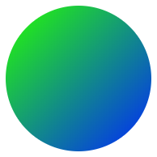

<p align="center"></p>

<h1 align="center">Gradient Avatar</h1>

<p align="center">🌈 Beautiful default avatars.</p>

## About 

Generate beautiful and unique avatars for your users. `gradient-avatar` was inspired by Zeit.

## Install

```
$ npm install gradient-avatar
```

## Usage

```js
const avatar = require('gradient-avatar');

avatar('uid');
// => the avatar svg
```

## API

### avatar(seed[, size])

#### seed

Type: `string`

The seed for the generated avatar. 

#### size

Type: `number`

The generated svg's size.

#### Returns

Type: `string`

The generated avatar svg.

## License

MIT © [Tobias Herber](http://tobihrbr.com)
